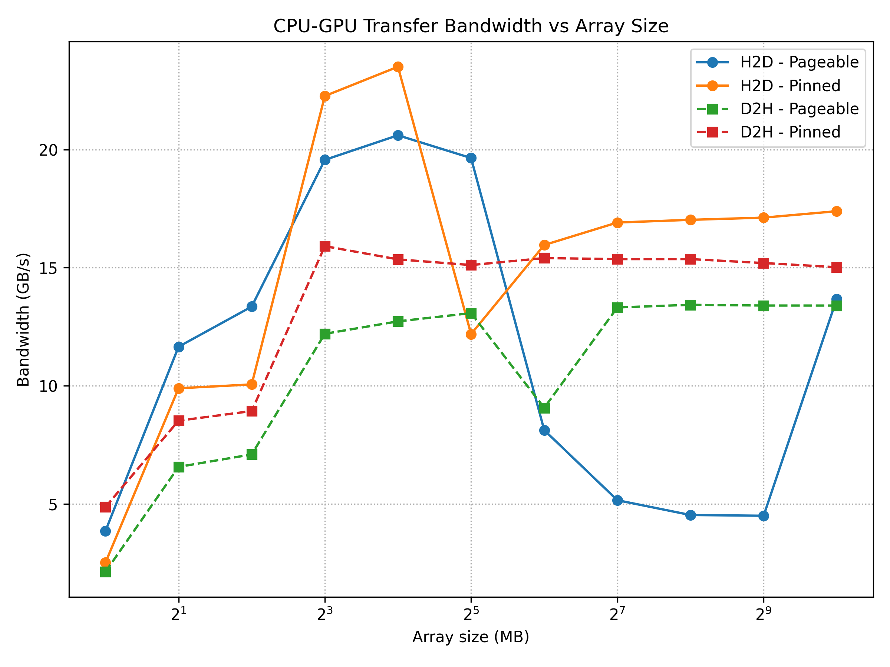

# CPU-GPU Data Transfer Bandwidth with CUDA

This project measures the effective memory transfer bandwidth between host (CPU) memory and device (GPU) memory using CUDA.

It evaluates:

- Host to Device (H2D) bandwidth
- Device to Host (D2H) bandwidth
- The impact of host memory type:
  - Pageable host memory (standard `malloc`)
  - Pinned host memory (`cudaHostAlloc`)

Results are reported as a function of transfer size (1 MB to 1 GB) and visualized as a bandwidth vs. array size plot.

---

## Project Structure

```text
.
├─ main.cu              # Entry point, runs all tests and prints CSV
├─ bandwidth.cu         # Implementation of bandwidth measurements
├─ bandwidth.h          # API and data structures for measurements
├─ cuda_utils.cuh       # CUDA error checking macro (CHECK_CUDA)
├─ Makefile             # Build script using nvcc
├─ plot_bandwidth.py    # Python script to generate bandwidth plot
├─ report.tex           # LaTeX report (optional, for writeup)
├─ bandwidth.csv        # Generated: raw measurement data (CSV)
└─ bandwidth_plot.png   # Generated: bandwidth vs. array size figure
```

---

## Requirements

### Hardware

- NVIDIA GPU with CUDA capability

### Software

- CUDA Toolkit installed (including `nvcc`)
- C++ compiler supported by your CUDA version
- Python 3 (for plotting)
- Python packages:
  - `numpy`
  - `matplotlib`
- LaTeX distribution (for compiling `report.tex`, optional)

Example installation for Python packages:

```bash
pip install numpy matplotlib
```

---

## Building the Project

The project is built using the provided `Makefile`.

From the project root directory:

```bash
make
```

This will:

- Compile `main.cu` and `bandwidth.cu` with `nvcc`
- Produce an executable named `bandwidth`

To clean build artifacts:

```bash
make clean
```

---

## Running the Bandwidth Benchmark

After building, run the benchmark and save the output to a CSV file:

```bash
./bandwidth > bandwidth.csv
```

This command will:

- Measure bandwidth for array sizes from 1 MB to 1 GB (powers of 2)
- Test both directions:
  - Host to Device (H2D)
  - Device to Host (D2H)
- Test both host memory types:
  - Pageable (`malloc`)
  - Pinned (`cudaHostAlloc`)
- Write a CSV file with the following header:

```text
size_MB,h2d_pageable_GBs,d2h_pageable_GBs,h2d_pinned_GBs,d2h_pinned_GBs
```

You can quickly inspect the file using:

```bash
head bandwidth.csv
```

---

## Tabulated Results

Below is a table version of the sample CSV output, showing effective bandwidth (GB/s) for each transfer size and configuration.

| Size (MB) | H2D Pageable | D2H Pageable | H2D Pinned | D2H Pinned |
|-----------|--------------|--------------|------------|------------|
| 1         | 3.846        | 2.118        | 2.506      | 4.864      |
| 2         | 11.652       | 6.564        | 9.892      | 8.520      |
| 4         | 13.352       | 7.090        | 10.056     | 8.928      |
| 8         | 19.567       | 12.200       | 22.272     | 15.912     |
| 16        | 20.608       | 12.727       | 23.510     | 15.352     |
| 32        | 19.644       | 13.076       | 12.188     | 15.112     |
| 64        | 8.120        | 9.064        | 15.961     | 15.407     |
| 128       | 5.152        | 13.316       | 16.913     | 15.363     |
| 256       | 4.525        | 13.428       | 17.027     | 15.364     |
| 512       | 4.494        | 13.397       | 17.120     | 15.197     |
| 1024      | 13.679       | 13.396       | 17.392     | 15.021     |

Interpretation in short:

- Small sizes (1 to 4 MB) are dominated by latency, so bandwidth is low and noisy.
- Medium sizes (8 to 32 MB) start to approach hardware limits.
- Large sizes show pinned memory consistently outperforming pageable memory, especially for H2D.

---

## Bandwidth Plot

Once `bandwidth.csv` has been created, use the Python script to generate a plot:

```bash
python plot_bandwidth.py
```

or:

```bash
python3 plot_bandwidth.py
```

The script will create `bandwidth_plot.png`. A typical plot looks like this:



The figure contains four curves:

- H2D - Pageable
- D2H - Pageable
- H2D - Pinned
- D2H - Pinned

You can include this figure in reports or presentations to visually compare how transfer size and host memory type affect bandwidth.

---

## Interpreting the Results

Typical observations:

- For small transfer sizes (for example 1 to 4 MB), measured bandwidth is low and noisy due to fixed overheads dominating (latency bound).
- As transfer size increases (for example 8 to 32 MB), the effective bandwidth rises and approaches a plateau that reflects the maximum practical throughput.
- For large transfer sizes (for example 64 MB and above):
  - Pinned memory usually achieves higher and more stable bandwidth than pageable memory.
  - H2D and D2H bandwidths may differ slightly due to hardware and driver asymmetries.

In general:

- Pinned memory is recommended for large, performance critical transfers.
- Grouping many small transfers into fewer large transfers improves overall efficiency.

